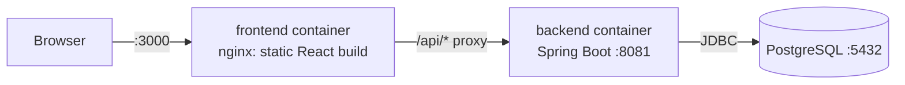

# Task Manager — Spring Boot + React

A full-stack task manager: a layered **Spring Boot 4 REST API** backed by **PostgreSQL**, and a **React 19** single-page app, all containerised with **Docker Compose** and tested in **GitHub Actions CI**.

| Layer | Technology |
|---|---|
| Backend | Java 21, Spring Boot 4.1 (Web MVC, Data JPA, Validation) |
| Database | PostgreSQL 17 (Docker); H2 in-memory for tests |
| Frontend | React 19, Vite |
| Testing | JUnit 5, Mockito, AssertJ, MockMvc (`@WebMvcTest`, `@SpringBootTest`) |
| DevOps | Docker (multi-stage builds), Docker Compose, nginx, GitHub Actions |

## Architecture



The backend follows a classic layered design inside a feature package (`task`):

```
HTTP ──► TaskController ──► TaskService ──► TaskRepository ──► PostgreSQL
          (web layer)       (business       (Spring Data JPA)
           DTOs in/out       logic, @Transactional)
               │
               └─ errors ──► GlobalExceptionHandler ──► RFC 9457 Problem Details JSON
```

- **Controller** handles HTTP only: routing, `@Valid` request validation, status codes, `Location` headers.
- **Service** owns business rules (trimming titles, not-found handling) and transaction boundaries.
- **Repository** is a Spring Data JPA interface; queries are derived from method names.
- **DTOs** (Java `record`s) are the API contract. The `Task` JPA entity is never exposed, so clients can't set `id`/`createdAt`, and the DB schema can change without breaking the API.
- **GlobalExceptionHandler** (`@RestControllerAdvice`) turns every error into a consistent `application/problem+json` body.

```
.
├── backend/                      Spring Boot API
│   ├── src/main/java/com/dinojan/taskmanager/
│   │   ├── task/                 Task feature: entity, repository, service, controller
│   │   │   └── dto/              CreateTaskRequest, UpdateTaskRequest, TaskResponse
│   │   ├── common/               GlobalExceptionHandler
│   │   └── config/               CORS (WebConfig, CorsProperties), DataSeeder
│   ├── src/test/                 Unit, web-slice and integration tests
│   └── Dockerfile
├── frontend/                     React app (Vite)
│   ├── src/App.jsx, src/api.js
│   ├── nginx.conf                Serves the build and proxies /api to the backend
│   └── Dockerfile
├── compose.yaml                  PostgreSQL + backend + frontend
└── .github/workflows/ci.yml      Backend tests + frontend lint/build
```

## Running it

### Option A: everything in Docker (no Java/Node needed)

```bash
docker compose up --build
```

Open **http://localhost:3000**. The API is also reachable directly at http://localhost:8081/api/tasks.
If port 3000 is already in use, pick another: `FRONTEND_PORT=3001 docker compose up --build`.
Data is stored in the `pgdata` Docker volume, so it survives restarts (`docker compose down -v` wipes it).

### Option B: local development (hot reload)

Prerequisites: Java 21, Node.js 22, Docker.

```bash
# 1. Start only PostgreSQL (published on host port 5433)
docker compose up -d db

# 2. Backend → http://localhost:8081
cd backend
./mvnw spring-boot:run          # Windows: .\mvnw spring-boot:run

# 3. Frontend → http://localhost:5173 (in another terminal)
cd frontend
npm install
npm run dev
```

The Vite dev server proxies `/api/*` to `localhost:8081` (see `frontend/vite.config.js`).

> **Why port 5433?** The container is published on 5433 so it doesn't clash with a locally installed PostgreSQL on the default 5432.

Inspect the database: `docker compose exec db psql -U tasks -d tasks -c "select * from tasks;"`

### Configuration

All settings have local-dev defaults in `application.properties` and can be overridden with environment variables:

| Variable | Default | Purpose |
|---|---|---|
| `DB_URL` | `jdbc:postgresql://localhost:5433/tasks` | JDBC URL |
| `DB_USERNAME` / `DB_PASSWORD` | `tasks` / `tasks` | Database credentials |
| `CORS_ALLOWED_ORIGINS` | `http://localhost:5173` | Comma-separated origins allowed to call the API from a browser |
| `SEED_DATA` | `true` | Insert sample tasks into an empty database |

## REST API

Base path: `/api/tasks`. All bodies are JSON.

| Method | Path | Description | Request body | Success |
|---|---|---|---|---|
| `GET` | `/api/tasks` | List all tasks, newest first | — | `200` |
| `GET` | `/api/tasks/{id}` | Get one task | — | `200` |
| `POST` | `/api/tasks` | Create a task | `{"title": "Buy milk"}` | `201` + `Location` header |
| `PUT` | `/api/tasks/{id}` | Replace title and status | `{"title": "Buy milk", "completed": true}` | `200` |
| `DELETE` | `/api/tasks/{id}` | Delete a task | — | `204` |

Task response:

```json
{ "id": 1, "title": "Buy milk", "completed": false, "createdAt": "2026-10-03T19:40:40.505918Z" }
```

Validation rules: `title` is required, not blank, max 255 characters (leading/trailing spaces are trimmed); `completed` is required on `PUT`.

### Errors

Errors use the [RFC 9457 Problem Details](https://www.rfc-editor.org/rfc/rfc9457) format (`Content-Type: application/problem+json`):

```json
{
  "title": "Bad Request",
  "status": 400,
  "detail": "Validation failed",
  "instance": "/api/tasks",
  "errors": { "title": "Title must not be blank" }
}
```

| Status | When |
|---|---|
| `400` | Validation failure (with per-field `errors`), malformed JSON, non-numeric id |
| `404` | Task id does not exist |
| `405` | Unsupported HTTP method |
| `500` | Unexpected error (details are logged, never returned to the client) |

## Testing

```bash
cd backend && ./mvnw test      # 23 tests, no database or Docker required
cd frontend && npm run lint && npm run build
```

| Test class | Type | What it covers |
|---|---|---|
| `TaskServiceTest` | Unit (JUnit + Mockito) | Business logic with a mocked repository: trimming, not-found, update/delete rules |
| `TaskControllerTest` | Web slice (`@WebMvcTest` + MockMvc) | Routes, status codes, JSON shape, validation errors, Problem Details, CORS, 500 handling |
| `TaskApiIntegrationTest` | Integration (`@SpringBootTest`) | Full create → read → update → delete flow through all layers against H2 |

Tests run with the `test` profile (`src/test/resources/application-test.properties`), which swaps PostgreSQL for in-memory H2 in PostgreSQL compatibility mode.

## Continuous integration

`.github/workflows/ci.yml` runs on every push to `main` and on pull requests, with two parallel jobs:

- **backend**: JDK 21 → `./mvnw -B test`
- **frontend**: Node 22 → `npm ci` → `npm run lint` → `npm run build`

## Possible next steps

- Database migrations with **Flyway** (replace `ddl-auto=update`)
- **Testcontainers** to run integration tests against real PostgreSQL
- OpenAPI/Swagger UI via springdoc
- Spring Boot **Actuator** health checks for container orchestration
- Pagination and filtering on `GET /api/tasks`
- Authentication with Spring Security
